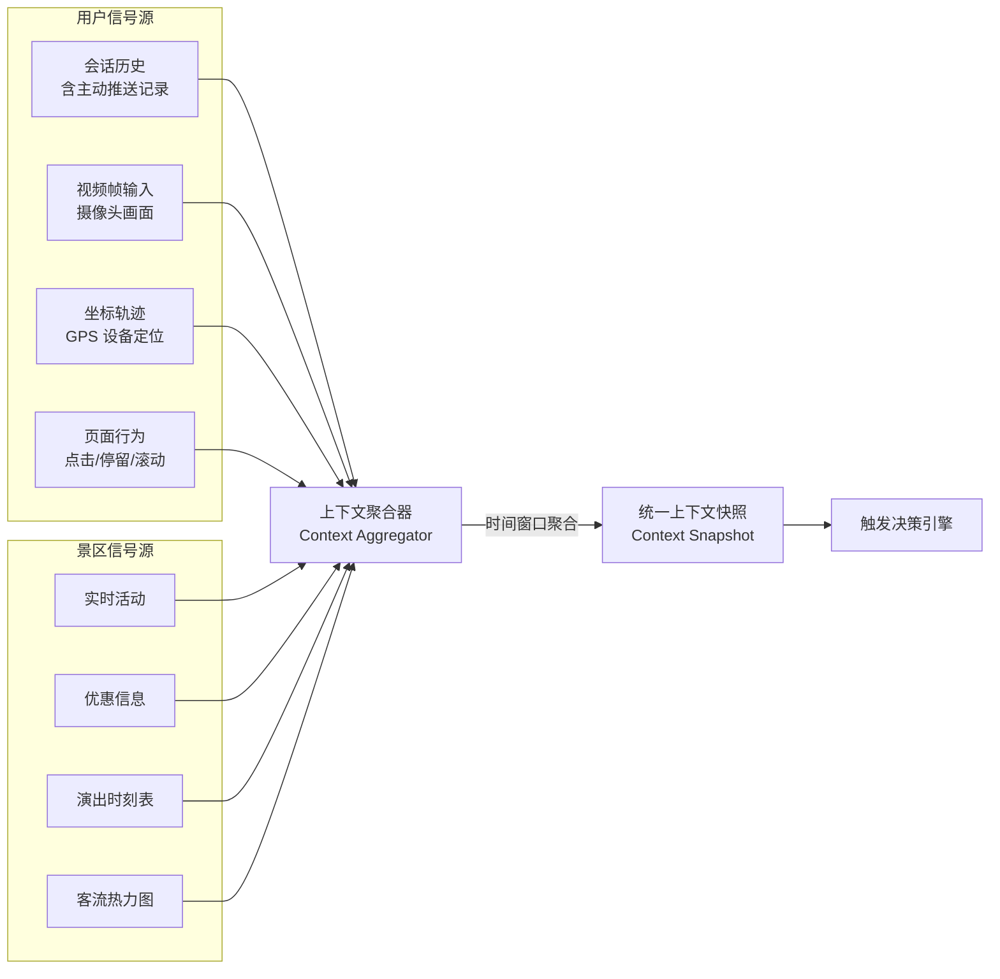
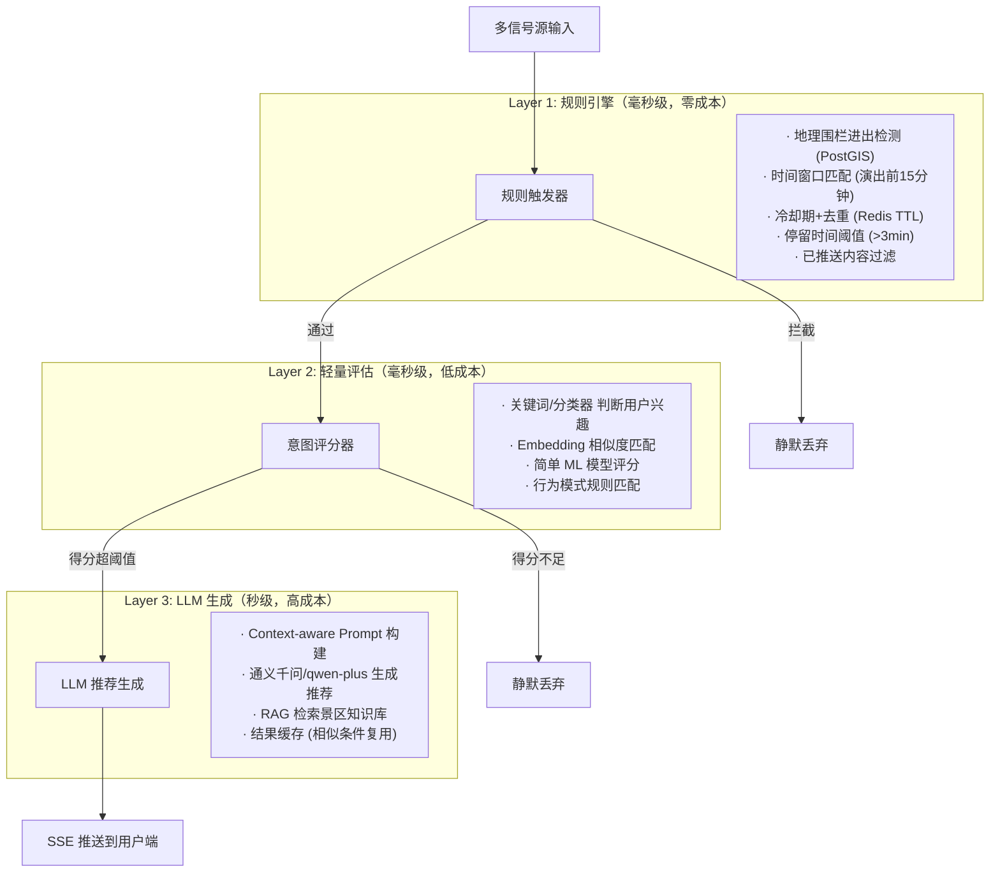
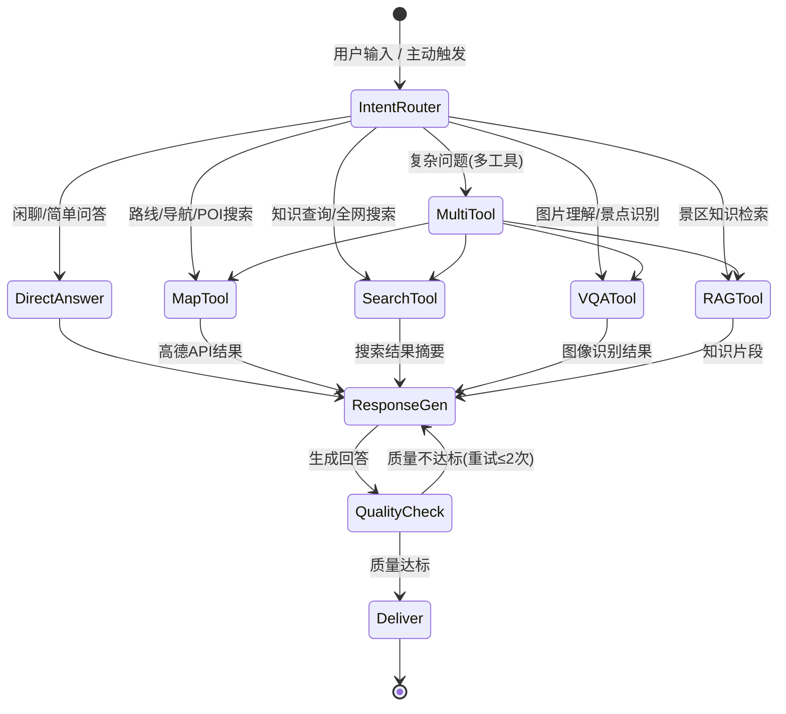
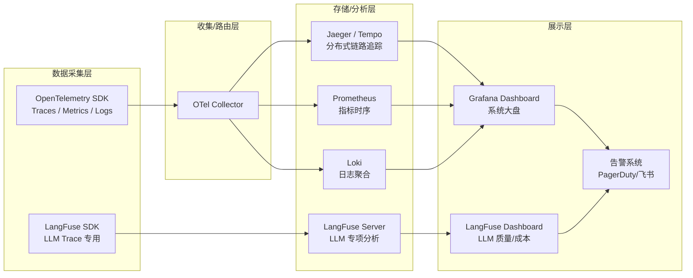

# AI伴游生产级架构设计方案

## 一、现状分析

当前项目为 **Vite + React + TypeScript** 单体前端应用，所有智能逻辑集中在浏览器端：

| 模块 | 现状 | 问题 |
|------|------|------|
| LLM对话 | 前端直连 DashScope API (qwen-plus) | API Key 暴露在前端，无法做 token 限流、会话上下文管理 |
| 视觉识别 | 前端直连 qwen-vl-plus，Base64 图片直传 | 无法做图像预处理/缓存/降采样，大图耗费用户带宽 |
| 景区数据 | Supabase 直连 + 硬编码 `scenic-data.js` | 无法做数据预热、权限控制、实时更新推送 |
| TTS/ASR | 浏览器原生 SpeechSynthesis/SpeechRecognition | 音质差、兼容性差、无法定制音色 |
| 状态管理 | Zustand 前端全局 Store | 无会话持久化，刷新即丢失 |
| 主动推荐 | 无 | 缺少基于位置/行为/时间的主动推送能力 |

---

## 二、目标架构总览

```mermaid
graph TB
    subgraph "前端 (React PWA / 小程序)"
        FE[移动端 UI]
        WS_CLIENT[WebSocket Client]
        SSE_CLIENT[SSE Client]
    end

    subgraph "API Gateway / 负载均衡"
        NGINX[Nginx / API Gateway]
    end

    subgraph "后端服务集群"
        subgraph "实时通信层"
            WS_SERVER[WebSocket Server<br/>双向实时通信]
            SSE_SERVER[SSE Push Server<br/>主动推送]
        end
        
        subgraph "Agent 编排层"
            ORCHESTRATOR[Agent Orchestrator<br/>LangGraph]
            ROUTER[意图路由器<br/>Intent Router]
        end
        
        subgraph "工具服务层"
            AMAP[高德地图服务]
            SEARCH[全网搜索服务]
            VQA[VQA 视觉问答]
            TTS_SVC[TTS 语音服务]
            ASR_SVC[ASR 语音识别]
            RAG[RAG 知识检索]
        end
        
        subgraph "主动推荐引擎"
            TRIGGER[触发决策引擎]
            CONTEXT[上下文聚合器]
            RECOMMENDER[分层推荐计算]
        end
    end
    
    subgraph "数据层"
        REDIS[(Redis<br/>会话缓存/Pub-Sub)]
        PG[(PostgreSQL + PostGIS<br/>业务数据)]
        VECTOR[(向量数据库<br/>Milvus/pgvector)]
        MQ[消息队列<br/>Redis Streams/Kafka]
    end
    
    subgraph "可观测性"
        OTEL[OpenTelemetry Collector]
        LANGFUSE[LangFuse<br/>LLM Trace]
        GRAFANA[Grafana<br/>Metrics/Dashboard]
    end

    FE <--> WS_CLIENT
    FE <--> SSE_CLIENT
    WS_CLIENT <--> NGINX
    SSE_CLIENT <--> NGINX
    NGINX <--> WS_SERVER
    NGINX <--> SSE_SERVER
    WS_SERVER <--> ORCHESTRATOR
    SSE_SERVER <-- TRIGGER
    ORCHESTRATOR <--> ROUTER
    ROUTER --> AMAP & SEARCH & VQA & TTS_SVC & ASR_SVC & RAG
    CONTEXT --> TRIGGER
    TRIGGER --> RECOMMENDER
    RECOMMENDER --> SSE_SERVER
    ORCHESTRATOR --> REDIS & PG
    CONTEXT --> REDIS & PG & MQ
    ORCHESTRATOR --> OTEL
    TRIGGER --> OTEL
    OTEL --> LANGFUSE & GRAFANA
```

---

## 三、前后端分离架构设计

### 3.1 通信协议选型

| 协议 | 用途 | 方向 | 选型理由 |
|------|------|------|----------|
| **WebSocket** | 用户主动对话、语音交互 | 双向 | 对话需要双向实时流；支持中途打断 |
| **SSE** | 主动推荐推送、景区活动通知 | 服务端→客户端 | 单向推送更轻量；自动重连；防火墙友好 |
| **REST API** | 景区数据CRUD、用户鉴权、配置管理 | 请求-响应 | 标准 HTTP，适合非实时操作 |

### 3.2 后端技术选型

| 技术 | 选型 | 理由 |
|------|------|------|
| **API框架** | **FastAPI (Python)** | 原生 async 支持、WebSocket/SSE 内建、与 LangChain/LangGraph 无缝集成、类型安全 |
| **Agent 编排** | **LangGraph** | 图状态机架构，适合复杂工具编排；内建 checkpoint/回放；生产级状态管理 |
| **数据库** | **PostgreSQL + PostGIS** | 关系型 + 地理空间查询原生支持；成熟稳定 |
| **缓存 & Pub/Sub** | **Redis** | 会话缓存、分布式锁、实时事件分发 |
| **向量检索** | **pgvector** (初期) → **Milvus** (规模化) | 景点知识库 RAG 检索 |
| **消息队列** | **Redis Streams** (初期) → **Kafka** (规模化) | 用户行为事件流、异步任务分发 |
| **ASGI Server** | **Uvicorn + Gunicorn** | 高性能 ASGI 多 worker 部署 |

### 3.3 前端改造要点

- 移除 `llm.ts` 中的直接 API 调用，改为 WebSocket 通信
- `useTourStore` 中的消息管理不变，但数据源从本地改为 WebSocket 流
- 新增 `useWebSocket` / `useSSE` hooks
- 新增 `useProactiveRecommendation` hook 接收 SSE 推送
- API Key 完全迁移到后端环境变量

---

## 四、实时主动 Agent 核心设计

### 4.1 多信号源上下文聚合模型



#### 数据存储模型

```sql
-- 用户会话表
CREATE TABLE user_sessions (
    id UUID PRIMARY KEY DEFAULT gen_random_uuid(),
    user_id VARCHAR(64) NOT NULL,
    scenic_id VARCHAR(64) NOT NULL,
    started_at TIMESTAMPTZ DEFAULT NOW(),
    ended_at TIMESTAMPTZ,
    metadata JSONB DEFAULT '{}'
);

-- 会话消息表（包含主动推送记录）
CREATE TABLE session_messages (
    id BIGSERIAL PRIMARY KEY,
    session_id UUID REFERENCES user_sessions(id),
    role VARCHAR(16) NOT NULL,  -- 'user' | 'assistant' | 'system' | 'proactive'
    content TEXT NOT NULL,
    content_type VARCHAR(32) DEFAULT 'text',  -- 'text' | 'image' | 'audio' | 'card'
    tool_calls JSONB,           -- 工具调用记录
    metadata JSONB,             -- 图片URL、TTS状态等附加信息
    created_at TIMESTAMPTZ DEFAULT NOW()
);
CREATE INDEX idx_session_messages_session ON session_messages(session_id, created_at);

-- 用户轨迹表（时序数据）
CREATE TABLE user_trajectories (
    id BIGSERIAL PRIMARY KEY,
    session_id UUID REFERENCES user_sessions(id),
    lng DOUBLE PRECISION NOT NULL,
    lat DOUBLE PRECISION NOT NULL,
    accuracy REAL,
    speed REAL,
    heading REAL,
    geom GEOGRAPHY(Point, 4326) GENERATED ALWAYS AS 
        (ST_SetSRID(ST_MakePoint(lng, lat), 4326)::geography) STORED,
    recorded_at TIMESTAMPTZ DEFAULT NOW()
);
CREATE INDEX idx_trajectories_geom ON user_trajectories USING GIST(geom);
CREATE INDEX idx_trajectories_session_time ON user_trajectories(session_id, recorded_at);

-- 用户行为事件表
CREATE TABLE user_behavior_events (
    id BIGSERIAL PRIMARY KEY,
    session_id UUID REFERENCES user_sessions(id),
    event_type VARCHAR(32) NOT NULL, -- 'poi_click'|'photo_take'|'card_expand'|'page_stay'
    event_data JSONB NOT NULL,       -- {poi_id, duration_ms, scroll_depth...}
    created_at TIMESTAMPTZ DEFAULT NOW()
);

-- 景区实时活动表
CREATE TABLE scenic_events (
    id SERIAL PRIMARY KEY,
    scenic_id VARCHAR(64) NOT NULL,
    event_type VARCHAR(32) NOT NULL, -- 'show'|'promotion'|'alert'|'weather'
    title VARCHAR(256) NOT NULL,
    description TEXT,
    location GEOGRAPHY(Point, 4326),
    radius_meters INT DEFAULT 500,
    start_time TIMESTAMPTZ,
    end_time TIMESTAMPTZ,
    priority INT DEFAULT 5,         -- 1-10, 越高越优先
    target_rules JSONB,             -- 投放条件: {"min_stay_minutes": 5}
    is_active BOOLEAN DEFAULT true,
    created_at TIMESTAMPTZ DEFAULT NOW()
);

-- 主动推送日志表（防重复、效果追踪）
CREATE TABLE proactive_push_log (
    id BIGSERIAL PRIMARY KEY,
    session_id UUID REFERENCES user_sessions(id),
    trigger_type VARCHAR(32) NOT NULL, -- 'geo_fence'|'time_based'|'behavior'|'event'
    event_id INT REFERENCES scenic_events(id),
    content TEXT NOT NULL,
    user_reaction VARCHAR(16),  -- 'clicked'|'dismissed'|'ignored'|null
    created_at TIMESTAMPTZ DEFAULT NOW()
);
```

### 4.2 分层计算架构（控制算力成本）

> [!IMPORTANT]
> 核心原则：**不是所有信号都需要调用 LLM**。通过三层过滤（规则层→轻量模型层→LLM层），将 LLM 调用压缩到必要最小量。



#### 触发时机控制策略

| 触发条件 | Layer 1 规则 | 冷却期 | 示例 |
|----------|-------------|--------|------|
| 地理围栏进入 | PostGIS `ST_DWithin` | 同一POI 30分钟 | 走近雷峰塔200m → 推送"雷峰塔故事" |
| 长时间停留 | 10分钟无位置移动 | 30分钟 | 某亭子停留 → 推送"附近茶馆推荐" |
| 演出接近 | `start_time - NOW() < 15min` | 该演出仅一次 | 西湖音乐喷泉即将开始 |
| 优惠即失效 | `end_time - NOW() < 30min` | 该优惠仅一次 | 限时折扣即将结束 |
| 拍照行为 | `event_type = 'photo_take'` | 5分钟 | 用户拍照 → 推送"拍照角度建议" |
| 组合触发 | 停留 + 天气 + 时段 | 60分钟 | 傍晚+湖边停留 → "推荐日落观赏点" |

### 4.3 Agent 工具编排（LangGraph 状态机）



#### 工具定义示例

| 工具名 | 描述 | 输入 | 输出 | API |
|--------|------|------|------|-----|
| `amap_route_plan` | 路线规划 | origin, destination, mode | 路线+预计时间+距离 | 高德路径规划 API |
| `amap_poi_search` | POI搜索 | keyword, location, radius | POI列表+距离+评分 | 高德搜索 API |
| `amap_poi_detail` | POI详情 | poi_id | 详细信息+评价+图片 | 高德详情 API |
| `web_search` | 全网搜索 | query | 摘要+来源链接 | 搜索引擎 API |
| `vqa_analyze` | 视觉问答 | image_base64, question | 识别结果+回答 | qwen-vl-plus |
| `rag_retrieve` | 知识检索 | query, scenic_id | Top-K 知识片段 | pgvector / Milvus |
| `weather_query` | 实时天气 | city / coordinates | 当前天气+预报 | 天气 API |
| `tts_synthesize` | 语音合成 | text, voice_id | audio_url | 阿里云 TTS |

### 4.4 视频帧处理策略（控制成本）

> [!WARNING]
> 视频帧是算力杀手。需要严格控制帧率和上传频率。

```
用户摄像头 (30fps)
    │
    ▼ 前端采样（每 3~5 秒取 1 帧）
    │
    ▼ 前端降分辨率（512×384, JPEG quality=0.5）
    │
    ▼ 前端变化检测（帧差 > 阈值才上传）
    │
    ▼ 上传到后端（~20KB/帧, 约 12帧/分钟）
    │
    ▼ Layer 1: 轻量特征提取（MobileSAM/CLIP-tiny, <50ms）
    │     ├── 命中已知 POI → 直接返回缓存知识
    │     └── 未命中 → 进入 Layer 2
    │
    ▼ Layer 2: VLM 调用（qwen-vl, 按需触发, ~2秒）
    │     └── 生成景物描述 → 缓存结果
    │
    ▼ 推送到用户端（如果有值得说的内容）
```

**成本估算**（per user per hour）：
- 帧传输：~14MB （12帧/min × 20KB × 60min）
- 轻量模型：~720次推理（本地/边缘，近似零成本）
- VLM 调用：约 30-60 次（仅新场景触发）
- 预估费用：VLM ≈ ¥0.3-0.6/小时/用户

---

## 五、可观测性设计

### 5.1 分层监控体系



### 5.2 核心监控指标

| 维度 | 指标 | 采集方式 | 告警阈值 |
|------|------|---------|----------|
| **LLM质量** | Token用量/响应时间/幻觉率 | LangFuse | 响应>5s, 幻觉>5% |
| **Agent** | 工具调用成功率/编排延迟 | OpenTelemetry Trace | 失败率>2%, 延迟>10s |
| **推荐** | 触发次数/用户点击率/推送疲劳度 | 自定义 Metrics | 点击率<5%, 疲劳阈值 |
| **系统** | CPU/内存/WebSocket连接数 | Prometheus+node_exporter | CPU>80%, 连接>10k |
| **业务** | DAU/会话时长/用户满意度 | 自定义 Events | 5分钟无新会话 |

### 5.3 LLM 链路追踪示例

```
[User Query: "附近有什么好吃的"] 
  ├── Trace ID: abc-123
  ├── Span: IntentRouter  (12ms)
  │     └── intent: "food_recommendation"
  ├── Span: RAG Retrieve  (45ms)
  │     └── retrieved 3 docs, relevance: [0.92, 0.87, 0.81]
  ├── Span: AMap POI Search (230ms)  
  │     └── found 8 restaurants within 1km
  ├── Span: LLM Generate  (1.2s)
  │     ├── model: qwen-plus
  │     ├── input_tokens: 856
  │     ├── output_tokens: 312
  │     └── cost: ¥0.003
  └── Span: TTS Synthesize (400ms)
        └── audio_duration: 15s
  Total: 1.9s, Cost: ¥0.003
```

---

## 六、系统可扩展性设计

### 6.1 插件化工具注册

采用 **注册表模式 + 动态发现**：

```python
# 工具注册伪代码
@tool_registry.register(
    name="amap_route_plan",
    description="规划两点间的步行/驾车路线",
    input_schema=RouteInput,
    output_schema=RouteOutput,
    cost_level="low",        # 成本等级标记
    latency_class="fast",    # 延迟等级
)
async def amap_route_plan(input: RouteInput) -> RouteOutput:
    ...
```

新增工具只需：
1. 实现函数 + 注册装饰器
2. Agent Orchestrator 自动发现并加入工具列表
3. 无需修改编排逻辑

### 6.2 多景区多租户扩展

```
景区配置层（per scenic_id）:
  ├── 导游人设 (prompt template)
  ├── 可用工具集 (工具白名单)
  ├── 主动推荐策略 (触发规则集)
  ├── 知识库快照 (RAG index)
  └── 品牌定制 (UI 主题/TTS 音色)
```

### 6.3 水平扩展策略

| 组件 | 扩展方式 | 瓶颈分析 |
|------|----------|----------|
| WebSocket Server | 多实例 + Redis Pub/Sub 广播 | 单机连接数受限于fd数，需水平扩展 |
| Agent Worker | 无状态 Worker + 任务队列 | LLM 调用是瓶颈，按需扩缩容 |
| 推荐引擎 | 定时批处理 + 实时轻量评估 | 规则层本地计算，LLM层队列化 |
| PostgreSQL | 读写分离 + 分区表(按时间) | 轨迹数据增长快，按月分区 |
| Redis | Cluster 模式 | 会话数据热点问题 |

---

## 七、后端服务分层目录结构

```
backend/
├── app/
│   ├── main.py                    # FastAPI 应用入口
│   ├── config.py                  # 环境配置
│   ├── api/
│   │   ├── ws.py                  # WebSocket 端点 (对话)
│   │   ├── sse.py                 # SSE 端点 (主动推送)
│   │   ├── rest.py                # REST API (景区数据CRUD)
│   │   └── auth.py                # 鉴权
│   ├── agent/
│   │   ├── orchestrator.py        # LangGraph Agent 编排
│   │   ├── router.py              # 意图路由
│   │   ├── prompts.py             # Prompt 模板
│   │   └── memory.py              # 会话记忆管理
│   ├── tools/
│   │   ├── registry.py            # 工具注册表
│   │   ├── amap.py                # 高德地图工具
│   │   ├── search.py              # 全网搜索工具
│   │   ├── vqa.py                 # 视觉问答工具
│   │   ├── rag.py                 # 知识检索工具
│   │   └── tts.py                 # TTS 合成工具
│   ├── proactive/
│   │   ├── engine.py              # 主动推荐引擎
│   │   ├── triggers.py            # 触发规则管理
│   │   ├── context.py             # 上下文聚合器
│   │   └── scorer.py              # 推荐评分器
│   ├── models/
│   │   ├── db.py                  # SQLAlchemy Models
│   │   └── schemas.py             # Pydantic Schemas
│   ├── services/
│   │   ├── session.py             # 会话管理服务
│   │   ├── trajectory.py          # 轨迹管理服务
│   │   └── event.py               # 景区事件服务
│   └── observability/
│       ├── tracing.py             # OpenTelemetry 配置
│       ├── metrics.py             # 自定义 Metrics
│       └── langfuse_integration.py # LangFuse 集成
├── alembic/                       # 数据库迁移
├── tests/
├── docker-compose.yml
├── Dockerfile
└── requirements.txt
```

---

## 八、实施路线建议

### Phase 1: 基础分离（2-3周）
- [ ] 搭建 FastAPI 后端骨架 + WebSocket/SSE 端点
- [ ] 迁移 LLM 调用到后端（`streamChat` → WebSocket）
- [ ] 迁移 VQA 调用到后端（`analyzeImage` → WebSocket）
- [ ] 前端改造通信层（`useWebSocket` hook）
- [ ] 基础 PostgreSQL 数据模型 + Alembic 迁移

### Phase 2: Agent 编排（2-3周）
- [ ] LangGraph Agent 编排器 + 意图路由
- [ ] 接入高德地图工具（路线规划、POI搜索）
- [ ] 接入全网搜索工具
- [ ] RAG 知识检索（pgvector）
- [ ] 会话记忆持久化

### Phase 3: 主动推荐（2-3周）
- [ ] 上下文聚合器（轨迹+行为+事件）
- [ ] 三层触发引擎（规则→评分→LLM）
- [ ] SSE 推送通道 + 前端接收
- [ ] 推送效果追踪 + 反馈闭环
- [ ] 视频帧分析 pipeline

### Phase 4: 可观测性 & 生产化（1-2周）
- [ ] OpenTelemetry 全链路追踪
- [ ] LangFuse 集成（LLM 专项监控）
- [ ] Grafana 监控大盘
- [ ] Docker Compose 一键部署
- [ ] 负载测试 + 性能优化

---

> [!NOTE]
> 本方案侧重于**技术选型、架构设计和数据模型**三个核心维度。各模块可按 Phase 渐进式实施，Phase 1 完成后即可实现基本的前后端分离并解决 API Key 暴露问题。后续阶段可并行推进。

